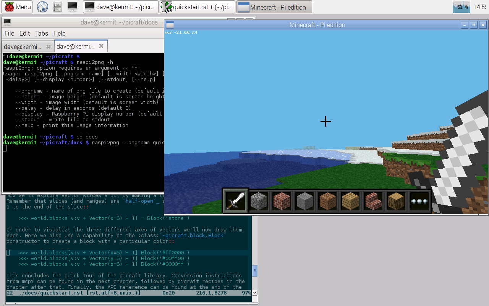
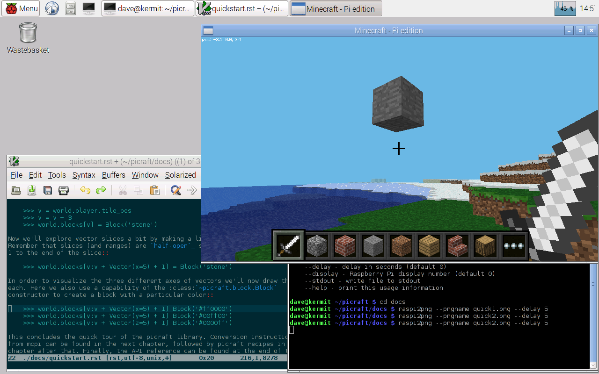
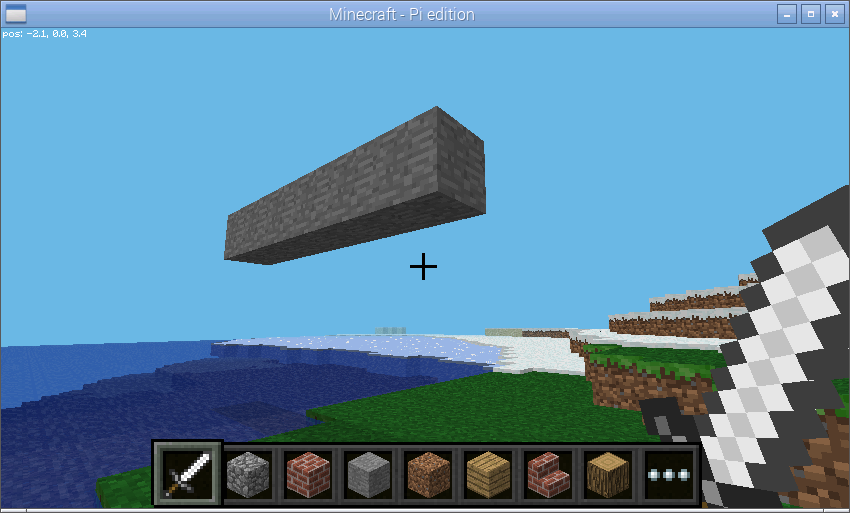
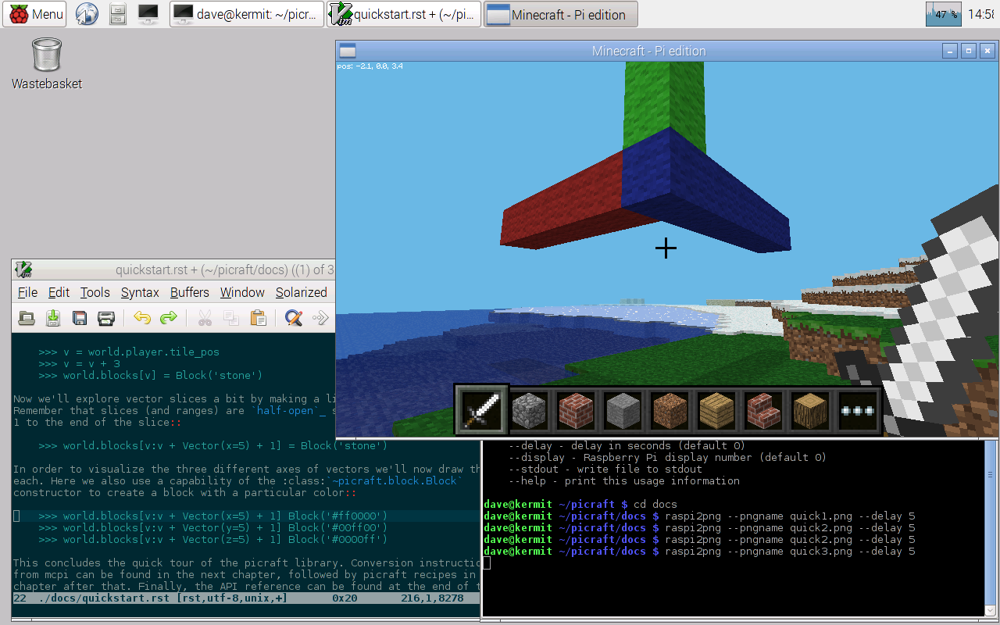
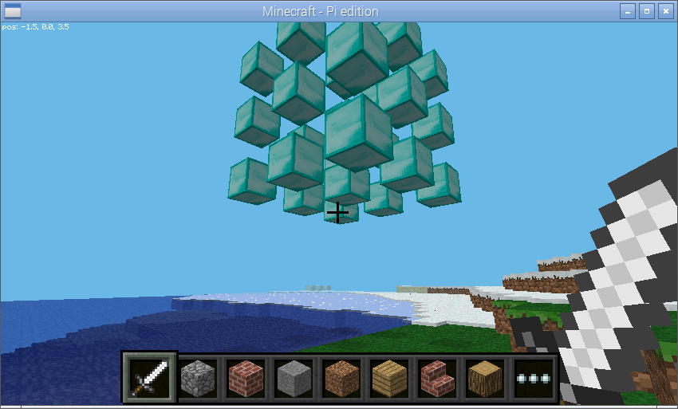

.. _quickstart:

===========
Quick Start
===========

The first thing you need to learn in picraft is vectors, and vector ranges. Er,
the two things you need to learn in picraft are vectors, vector ranges, and
blocks. The three things ... look, I'll just come in again.

Firstly, ensure that you have a `Minecraft game`_ running on your Pi. Now start
a terminal, start Python within the terminal, import the picraft library and
start a connection to the Minecraft world::

    >>> from picraft import World, Vector, Block
    >>> world = World()

The :class:`~picraft.world.World` class is the usual starting point for picraft
scripts. It provides access to the blocks that make up the world, the players
within the world, methods to save and restore the state of the world, and the
ability to print things to the chat console. Let's start by printing something
to the console::

    >>> world.say('Hello, world!')

You should see "Hello, world!" appear in the chat console of the Minecraft
game.  Next, we can query where we're standing with the
:attr:`~picraft.player.HostPlayer.pos` attribute of the
:attr:`~picraft.world.World.player` attribute::

    >>> world.player.pos
    Vector(x=-2.49725, y=18.0, z=-4.21989)

This tells us that our character is standing at the 3-dimensional coordinates
-2.49, 18.0, -4.22 (approximately). In the Minecraft world, the X and Z
coordinates (the first and last) form the "ground plane". In other words you
can think of X as going left to right, and Z as going further to nearer. The Y
axis represents height (it goes up and down). We can find out our player's
coordinates rounded to the nearest block with the
:attr:`~picraft.player.HostPlayer.tile_pos` attribute::

    >>> world.player.tile_pos
    Vector(x=-3, y=18, z=-5)

Therefore, we can make our character jump in the air by adding a certain amount
to the player's Y coordinate. To do this we need to construct a
:class:`~picraft.vector.Vector` with a positive Y value and add it to the
:attr:`~picraft.player.HostPlayer.tile_pos` attribute::

    >>> world.player.tile_pos = world.player.tile_pos + Vector(y=5)

We can also use a Python short-hand for this::

    >>> world.player.tile_pos += Vector(y=5)

This demonstrates one way of constructing a :class:`~picraft.vector.Vector`.
We can also construct one by listing all 3 coordinates explicitly::

    >>> Vector(y=5)
    Vector(x=0, y=5, z=0)
    >>> Vector(0, 5, 0)
    Vector(x=0, y=5, z=0)

We can use the :attr:`~picraft.world.World.blocks` attribute to discover the
type of each block in the world. For example, we can find out what sort of
block we're currently standing on::

    >>> world.blocks[world.player.tile_pos - Vector(y=1)]
    <Block "grass" id=2 data=0>

We can assign values to this property to change the sort of block we're
standing on. In order to do this we need to construct a new
:class:`~picraft.block.Block` instance which can be done by specifying the
id manually, or by name::

    >>> Block(1)
    <Block "stone" id=1 data=0>
    >>> Block('stone')
    <Block "stone" id=1 data=0>

Now we'll change the block beneath our feet::

    >>> world.blocks[world.player.tile_pos - Vector(y=1)] = Block('stone')

We can query the state of many blocks surrounding us by providing a vector
slice to the :attr:`~picraft.world.World.blocks` attribute. To make things
a little easier we'll store the base position first::

    >>> v = world.player.tile_pos - Vector(y=1)
    >>> world.blocks[v - Vector(1, 0, 1):v + Vector(2, 1, 2)]
    [<Block "grass" id=2 data=0>,
     <Block "grass" id=2 data=0>,
     <Block "grass" id=2 data=0>,
     <Block "grass" id=2 data=0>,
     <Block "stone" id=1 data=0>,
     <Block "grass" id=2 data=0>,
     <Block "grass" id=2 data=0>,
     <Block "grass" id=2 data=0>,
     <Block "grass" id=2 data=0>]

Note that the range provided (as with all ranges in Python) is `half-open`_,
which is to say that the lower end of the range is *inclusive* while the upper
end is *exclusive*. You can see this explicitly with the
:func:`~picraft.vector.vector_range` function::

    >>> v
    Vector(x=-2, y=14, z=3)
    >>> list(vector_range(v - Vector(1, 0, 1), v + Vector(2, 1, 2)))
    [Vector(x=-3, y=14, z=2),
     Vector(x=-3, y=14, z=3),
     Vector(x=-3, y=14, z=4),
     Vector(x=-2, y=14, z=2),
     Vector(x=-2, y=14, z=3),
     Vector(x=-2, y=14, z=4),
     Vector(x=-1, y=14, z=2),
     Vector(x=-1, y=14, z=3),
     Vector(x=-1, y=14, z=4)]

This may seem a clunky way of specifying a range and, in the manner shown above
it is. However, most standard infix arithmetic operations applied to a vector
are applied to *all* its elements::

    >>> Vector()
    Vector(x=0, y=0, z=0)
    >>> Vector() + 1
    Vector(x=1, y=1, z=1)
    >>> 2 * (Vector() + 1)
    Vector(x=2, y=2, z=2)

This makes construction of such ranges or slices considerably easier. For
example, to construct a vertical range of vectors from the origin (0, 0, 0) to
(0, 10, 0) we first assign the origin to ``v`` which we use for the start of
the range, then add ``Vector(y=10)`` to it, and finally add one to compensate
for the half-open nature of the range::

    >>> v = Vector()
    >>> list(vector_range(v, v + Vector(y=10) + 1))
    [Vector(x=0, y=0, z=0),
     Vector(x=0, y=1, z=0),
     Vector(x=0, y=2, z=0),
     Vector(x=0, y=3, z=0),
     Vector(x=0, y=4, z=0),
     Vector(x=0, y=5, z=0),
     Vector(x=0, y=6, z=0),
     Vector(x=0, y=7, z=0),
     Vector(x=0, y=8, z=0),
     Vector(x=0, y=9, z=0),
     Vector(x=0, y=10, z=0)]

We can also re-write the example before this (the blocks surrounding the one
the player is standing on) in several different ways::

    >>> v = world.player.tile_pos
    >>> list(vector_range(v - 1, v + 2 - Vector(y=2)))
    [Vector(x=-3, y=14, z=2),
     Vector(x=-3, y=14, z=3),
     Vector(x=-3, y=14, z=4),
     Vector(x=-2, y=14, z=2),
     Vector(x=-2, y=14, z=3),
     Vector(x=-2, y=14, z=4),
     Vector(x=-1, y=14, z=2),
     Vector(x=-1, y=14, z=3),
     Vector(x=-1, y=14, z=4)]

We can change the state of many blocks at once similarly by assigning a new
:class:`~picraft.block.Block` object to a slice of blocks::

    >>> v = world.player.tile_pos
    >>> world.blocks[v - 1:v + 2 - Vector(y=2)] = Block('stone')

This is a relatively quick operation, as it only involves a single network
call. However, re-writing the state of multiple blocks with different values
is more time consuming::

    >>> world.blocks[v - 1:v + 2 - Vector(y=2)] = [
    ...     Block('wool', data=i) for i in range(9)]

You should notice that the example above takes a few seconds to process (each
block requires a separate network transaction and due to deficiencies in the
:ref:`Minecraft network protocol <protocol>`, each transaction takes a while to
execute). This can be accomplished considerably more quickly by batching
multiple requests together::

    >>> world.blocks[v - 1:v + 2 - Vector(y=2)] = Block('stone')
    >>> with world.connection.batch_start():
    ...     world.blocks[v - 1:v + 2 - Vector(y=2)] = [
    ...         Block('wool', data=i) for i in range(9)]

You should notice the example above executes considerably more quickly.
Finally, the state of the Minecraft world can be saved and restored easily with
the :attr:`~picraft.world.World.checkpoint` object::

    >>> world.checkpoint.save()
    >>> world.blocks[v - 1:v + 2 - Vector(y=2)] = Block('stone')
    >>> world.checkpoint.restore()

In order to understand vectors, it can help to visualize them. Pick a
relatively open area in the game world.

We'll save the vector of your player's position as ``v`` then add 3 to it. This
moves the vector 3 along each axis (X, Y, and Z).  Next, we'll make the block
at ``v`` into stone::

    >>> v = world.player.tile_pos
    >>> v = v + 3
    >>> world.blocks[v] = Block('stone')

Now we'll explore vector slices a bit by making a line along X+5 into stone.
Remember that slices (and ranges) are `half-open`_ so we need to add an extra
1 to the end of the slice::

    >>> world.blocks[v:v + Vector(x=5) + 1] = Block('stone')

In order to visualize the three different axes of vectors we'll now draw them
each. Here we also use a capability of the :class:`~picraft.block.Block`
constructor to create a block with a particular color::

    >>> world.blocks[v:v + Vector(x=5) + 1] = Block('#ff0000')
    >>> world.blocks[v:v + Vector(y=5) + 1] = Block('#00ff00')
    >>> world.blocks[v:v + Vector(z=5) + 1] = Block('#0000ff')

Finally, we can use a vector range to demonstrate patterns. Firstly we wipe
out our axes by setting the entire block to "air". Then we define a vector
range over the same block with a step of 2, and iterate over each vector within
setting it to diamond::

    >>> world.blocks[v:v + 6] = Block('air')
    >>> r = vector_range(v, v + 6, Vector() + 2)
    >>> for rv in r:
    ...     world.blocks[rv] = Block('diamond_block')

Once again, we can make use of a batch to speed this up::

    >>> world.blocks[v:v + 6] = Block('air')
    >>> with world.connection.batch_start():
    ...     for rv in r:
    ...         world.blocks[rv] = Block('diamond_block')

This concludes the quick tour of the picraft library. Conversion instructions
from mcpi can be found in the next chapter, followed by picraft recipes in the
chapter after that. Finally, the API reference can be found at the end of the
manual.

.. _Minecraft game: https://www.raspberrypi.org/documentation/usage/minecraft/README.md
.. _half-open: http://python-history.blogspot.co.uk/2013/10/why-python-uses-0-based-indexing.html

