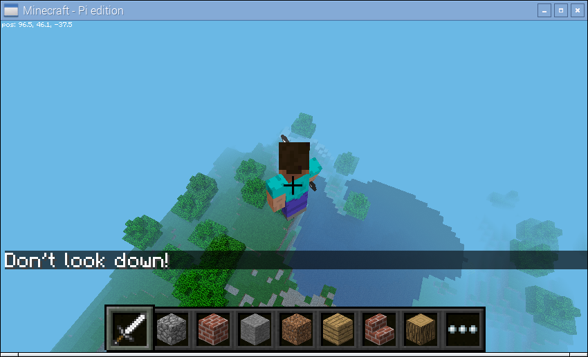
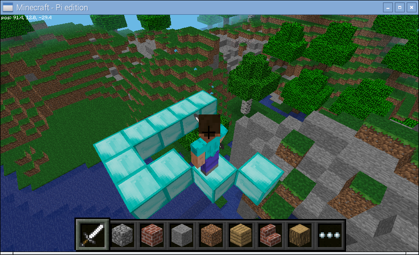
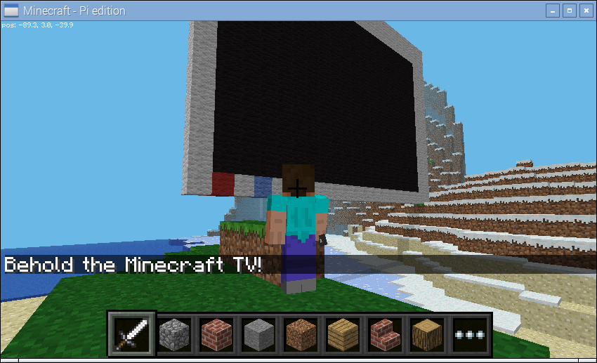

.. _recipes:

=======
Recipes
=======

This section introduces a variety of "recipes": small scripts that demonstrate
how to achieve something using the picraft library. Suggestions for new recipes
are gratefully received: please `e-mail the author`_!

.. _e-mail the author: mailto:dave@waveform.org.uk

Player Position
===============

The player's position can be easily queried with the
:attr:`~picraft.player.Player.pos` attribute. The value is a
:class:`~picraft.vector.Vector`. For example, on the command line::

    >>> world = World()
    >>> world.player.pos
    Vector(x=2.3, y=1.1, z=-0.81)

Teleporting the player is as simple as assigning a new vector to the player
position.  Here we teleport the player into the air by adding 50 to the Y-axis
of the player's current position (remember that in the Minecraft world, the
Y-axis goes up/down)::

    >>> world.player.pos = world.player.pos + Vector(y=50)

Or we can use a bit of Python short-hand for this::

    >>> world.player.pos += Vector(y=50)

If you want the player position to the nearest block use the
:attr:`~picraft.player.Player.tile_pos` instead::

    >>> world.player.tile_pos
    Vector(x=2, y=1, z=-1)

Blocks
======

The state of blocks in the world can be queried and changed by reading and
writing to the :attr:`~picraft.world.World.blocks` attribute. This is indexed
with a :class:`~picraft.vector.Vector` (or slice of vectors) and returns or
accepts a :class:`~picraft.block.Block` instance. For example, on the command
line we can find out the type of block we're standing on like so::

    >>> world = World()
    >>> p = world.player.tile_pos
    >>> world.blocks[p - Y]
    <Block "dirt" id=3 data=0>

We can modify the block we're standing on by assigning a new block type to it::

    >>> world.blocks[p - Y] = Block('stone')

We can modify several blocks surrounding the one we're standing on by assigning
to a slice of blocks. Remember that Python slices are `half-open`_ so the
easiest way to specify the slice is to specify the start and the end
inclusively and then simply add one to the end. Here we'll change ``p`` to
represent the vector of the block beneath our feet, then set it and all
immediately surrounding blocks to stone::

    >>> p -= Y
    >>> world.blocks[p - (X + Z):p + (X + Z) + 1] = Block('stone')

.. image:: blocks.png
    :align: center

.. _half-open: http://python-history.blogspot.co.uk/2013/10/why-python-uses-0-based-indexing.html

Auto Bridge
===========

This recipe (and several others in this chapter) was shamelessly stolen from
`Martin O'Hanlon's excellent site`_ which includes lots of recipes (although at
the time of writing they're all for the mcpi API). In this case the original
script can be found in Martin's `auto-bridge project`_.

The script tracks the position and likely future position of the player as
they walk through the world. If the script detects the player is about to walk
onto air it changes the block to diamond:

.. literalinclude:: bridge.py
    :caption: bridge.py

Note that the script starts by initializing the connection with the
``ignore_errors=True`` parameter. This causes the picraft library to act like
the mcpi library: errors in "set" calls are ignored, but the library reacts
faster because of this. This is necessary in a script like this where rapid
reaction to player behaviour is required.

.. _event_driven:

Events
======

The auto-bridge recipe above demonstrates a form of reacting to changes, in
that case player position changing. There is a formal event handling mechanism
in Minecraft, but at the time of writing the API only exposes the "block hit"
event which occurs when a player hits a block with their sword (by right
clicking).

The picraft library provides two different ways of working with events; you can
select whichever one suits your particular application. The basic way of
reacting to events is to periodically "poll" Minecraft for them (with the
:meth:`~picraft.events.Events.poll` method). This will return a list of all
events that occurred since the last time your script polled the server. For
example, the following script prints a message to the console when you hit a
block, detailing the block's coordinates and the face that you hit:

.. literalinclude:: poll.py
    :caption: poll.py

This is fine for simple scripts but you can probably see how more complex
scripts that check exactly which block has been hit start to involve long
series of ``if`` statements which look a bit ugly in code. The following script
creates a couple of blocks near the player on startup: a black block (which
ends the script when hit), and a white block (which makes multi-colored blocks
fall from the sky):

.. literalinclude:: rain1.py
    :caption: rain1.py

The alternate method of event handling in picraft is to rely on picraft's
built-in event loop. This involves "tagging" functions which will react to
block hits with the :meth:`~picraft.events.Events.on_block_hit` decorator, then
running the :meth:`~picraft.events.Events.main_loop` method. This causes
picraft to continually poll the server and call the tagged functions when their
criteria are matched by a block-hit event:

.. literalinclude:: rain2.py
    :caption: rain2.py
    :emphasize-lines: 13,17

One advantage of this method (other than slightly cleaner code) is that event
handlers can easily be made multi-threaded (to run in parallel with each other)
simply by modifying the decorator used:

.. literalinclude:: rain3.py
    :caption: rain3.py
    :emphasize-lines: 17

Now you should find that the rain all falls simultaneously (more or less, given
the constraints of the Pi's bandwidth!) when you hit the white block multiple
times. If you find the rain too slow, you can try using the ``ignore_errors``
parameter as in the bridge recipe above but in this case you may need to
introduce some pauses to the loop!

.. image:: rain.png
    :align: center

Shapes
======

This recipe demonstrates drawing shapes with blocks in the Minecraft world. The
picraft library includes a couple of rudimentary routines for calculating the
points necessary for drawing lines:

* :func:`~picraft.vector.line` which can be used to calculate the positions
  along a single line

* :func:`~picraft.vector.lines` which calculates the positions along a series
  of lines

Here we will attempt to construct a script which draws each regular polygon
from an equilateral triangle up to a regular octagon. First we start by
defining a function which will generate the points of a regular polygon. This
is relatively simple: the interior angles of a polygon always add up to 180
degrees so the angle to turn each time is 180 divided by the number of sides.
Given an origin and a side-length it's a simple matter to iterate over each
side generating the necessary point:

.. literalinclude:: shapes1.py
    :caption: shapes1.py

Next we need a function which will iterate over the number of sides for each
required polygon, using the :func:`~picraft.vector.lines` function to generate
the points required to draw the shape. Then it's a simple matter to draw each
polygon in turn, wiping it before displaying the next one:

.. literalinclude:: shapes2.py
    :caption: shapes2.py

.. image:: shapes.png
    :align: center

Models
======

This recipe demonstrates drawing models defined by `object files`_. This is a
venerable file format from `Alias|Wavefront`_. It's a simple text-based format
that defines the vertices, faces, and other aspects of a model, including the
materials of the model. The picraft library includes a rudimentary parser and
renderer for this format which can be used to render such models as blocks in
the Minecraft world.

Below is an example object file, which defines the walls and ceiling of a
house.

.. literalinclude:: house.obj
    :caption: house.obj

We can render this model with the following simple code:

.. literalinclude:: house.py
    :caption: house.py

.. image:: house.png
    :align: center

By default, the picraft renderer assumes that the material names are Minecraft
block types (see :attr:`.Block.NAMES`). However, this is frequently not the
case in which case you will need to "map" the material names to block types
yourself. A materials map can be as simple as a :class:`dict` mapping material
names to :class:`~picraft.block.Block` instances. For example:

.. literalinclude:: materials.py
    :caption: materials.py

.. image:: airboat.png
    :align: center

To find out what materials are defined on a model, you can query the
:attr:`~picraft.render.Model.materials` attribute. Note that some faces may
have no material associated with them, in which case their material is listed
as ``None`` (not the blank string).

A materials map can also be a function. This will be called with the face being
rendered and must return a :class:`~picraft.block.Block` instance or ``None``
(if you don't want that particular face to be rendered). This is useful for
quickly previewing a shape without performing any material mapping; simply
provide a function which always returns the same block type:

.. literalinclude:: preview.py
    :caption: preview.py

.. _object files: https://en.wikipedia.org/wiki/Wavefront_.obj_file
.. _Alias|Wavefront: https://en.wikipedia.org/wiki/Alias_Systems_Corporation

Animation
=========

This recipe demonstrates, in a series of steps, the construction of a
simplistic animation system in Minecraft. Our aim is to create a simple stone
cube which rotates about the X axis somewhere in the air. Our first script uses
:func:`~picraft.vector.vector_range` to obtain the coordinates of all blocks
within the cube, then uses the :meth:`~picraft.vector.Vector.rotate` method to
rotate them about the X axis:

.. literalinclude:: anim1.py
    :caption: anim1.py

As you can see in the script above we draw the first frame, wait for a bit,
then wipe the frame by setting all coordinates in that frame's state back to
"air". Then we draw the second frame and wait for a bit.

Although this approach works, it's obviously very long winded for lots of
frames. What we want to do is calculate the state of each frame in a function.
This next version demonstrates this approach; we use a generator function to
yield the state of each frame in turn so we can iterate over the frames with
a simple :keyword:`for` loop.

We represent the state of a frame of our animation as a dict which maps
coordinates (in the form of :class:`~picraft.vector.Vector` instances) to
:class:`~picraft.block.Block` instances:

.. literalinclude:: anim2.py
    :caption: anim2.py

That's more like it, but the updates aren't terribly fast despite using the
batch functionality. In order to improve this we should only update those
blocks which have actually changed between each frame. Thankfully, because
we're storing the state of each as a dict, this is quite easy:

.. literalinclude:: anim3.py
    :caption: anim3.py

Note: this still isn't perfect. Ideally, we would identify contiguous blocks of
coordinates to be updated which have the same block and set them all at the
same time (which will utilize the :ref:`world.setBlocks` call for efficiency).
However, this is relatively complex to do well so I shall leave it as an
exercise for you, dear reader!

Minecraft TV
============

If you've got a Raspberry Pi camera module, you can build a TV to view a live
feed from the camera in the Minecraft world. Firstly we need to construct a
class which will accept JPEGs from the camera's MJPEG stream, and render them
as blocks in the Minecraft world. Then we need a class to construct the TV
model itself and enable interaction with it:

.. literalinclude:: tv.py
    :caption: tv.py

Don't expect to be able to recognize much in the Minecraft TV; the resolution
is extremely low and the color matching is far from perfect. Still, if you
point the camera at obvious blocks of primary colors and move it around slowly
you should see a similar result on the in-game display.

The script includes the ability to position and size the TV as you like, and
you may like to experiment with adding new controls to it!

.. _Martin O'Hanlon's excellent site: http://www.stuffaboutcode.com/
.. _auto-bridge project: http://www.stuffaboutcode.com/2013/02/raspberry-pi-minecraft-auto-bridge.html
.. _in-game piano project: http://www.stuffaboutcode.com/2013/06/raspberry-pi-minecraft-piano.html
