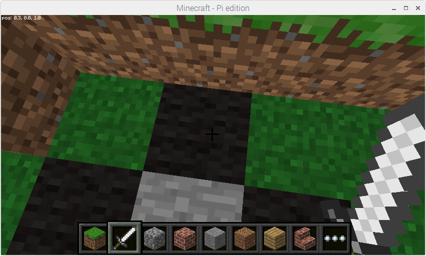
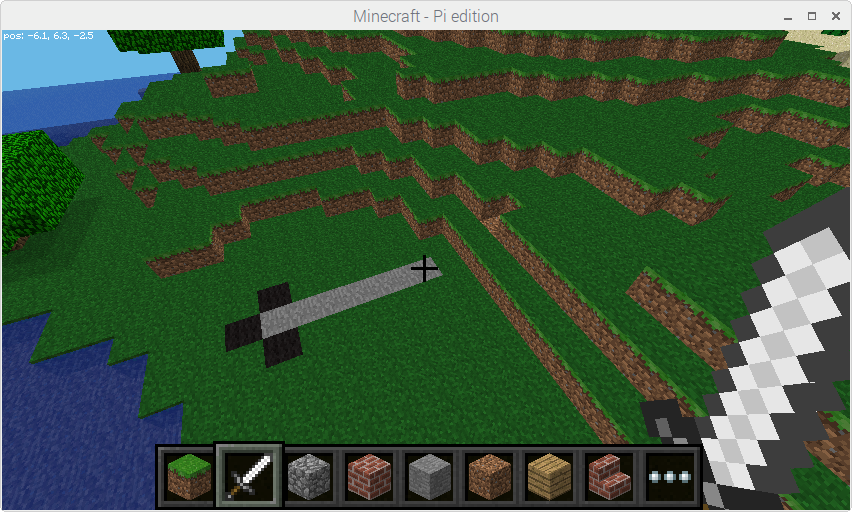
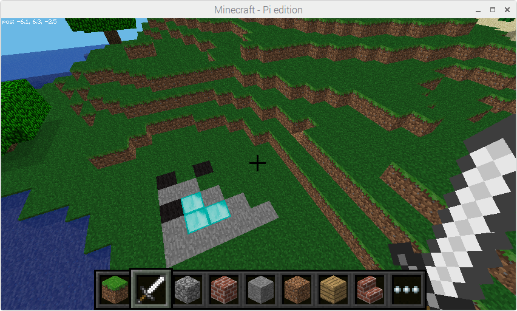

.. _turtle:

===============
Turtle Graphics
===============

.. module:: picraft.turtle

Turtle graphics is a popular way for introducing programming to kids. It was
part of the original Logo programming language developed by Wally Feurzig and
Seymour Papert in 1966.

The :mod:`turtle` module in Python's standard library provides a classic
implementation which moves a triangular turtle around a graphical window
drawing geometric shapes.

The picraft turtle module is similar, but instead of a two-dimensional
graphical window, its canvas is the Minecraft world. The module provides an
object-oriented interface for advanced users that want to control multiple
turtles and a simpler procedural interface for newer programmers.

When the turtle is initially created or shown, its default position is beneath
the player's feet::

    >>> from picraft.turtle import *
    >>> showturtle()

The turtle's shape indicates its "forward" direction. Various simple commands
can be used to control its orientation and motion::

    >>> right(180)
    >>> forward(5)

Every operation can be undone, and commands can be built up to construct
whole shapes::

    >>> undo()
    >>> penup()
    >>> forward(5)
    >>> left(90)
    >>> pendown()
    >>> fillblock('diamond_block')
    >>> fill(True)
    >>> forward(3)
    >>> left(90)
    >>> forward(4)
    >>> left(135)
    >>> forward(4)
    >>> fill(False)

Overview of available Turtle and TurtleScreen methods
=====================================================

Turtle methods
--------------

Turtle motion
    Move and draw
        | :func:`forward` | :func:`fd`
        | :func:`backward` | :func:`bk` | :func:`back`
        | :func:`left` | :func:`lt`
        | :func:`right` | :func:`rt`
        | :func:`up`
        | :func:`down` | :func:`dn`
        | :func:`goto` | :func:`setpos` | :func:`setposition`
        | :func:`setx`
        | :func:`sety`
        | :func:`setz`
        | :func:`setheading` | :func:`seth`
        | :func:`setelevation` | :func:`sete`
        | :func:`home`

    Tell Turtle's state
        | :func:`position` | :func:`pos`
        | :func:`towards`
        | :func:`heading`
        | :func:`elevation`
        | :func:`xcor`
        | :func:`ycor`
        | :func:`zcor`
        | :func:`distance`

Pen control
    Drawing state
        | :func:`pendown` | :func:`pd`
        | :func:`penup` | :func:`pu`
        | :func:`isdown`

    Block control
        | :func:`penblock`
        | :func:`fillblock`

    Filling
        | :func:`fill`
        | :func:`begin_fill`
        | :func:`end_fill`

    More drawing control
        | :func:`reset`
        | :func:`clear`

Turtle state
    Visibility
        | :func:`showturtle` | :func:`st`
        | :func:`hideturtle` | :func:`ht`
        | :func:`isvisible`

Special Turtle methods
    | :func:`undobufferentries`
    | :func:`getturtle` | :func:`getpen`
    | :func:`getscreen`

Methods of Turtle and corresponding functions
=============================================

Turtle motion
-------------

.. autofunction:: fd
.. autofunction:: forward

.. autofunction:: back
.. autofunction:: bk
.. autofunction:: backward

.. autofunction:: lt
.. autofunction:: left

.. autofunction:: rt
.. autofunction:: right

.. autofunction:: up

.. autofunction:: dn
.. autofunction:: down

.. autofunction:: setpos
.. autofunction:: setposition
.. autofunction:: goto

.. autofunction:: setx

.. autofunction:: sety

.. autofunction:: setz

.. autofunction:: seth
.. autofunction:: setheading

.. autofunction:: sete
.. autofunction:: setelevation

.. autofunction:: home

.. autofunction:: undo

Tell Turtle's state
-------------------

.. autofunction:: position
.. autofunction:: pos

.. autofunction:: towards

.. autofunction:: heading

.. autofunction:: elevation

.. autofunction:: xcor

.. autofunction:: ycor

.. autofunction:: zcor

.. autofunction:: distance

Pen control
===========

Drawing state
-------------

.. autofunction:: pd
.. autofunction:: pendown

.. autofunction:: pu
.. autofunction:: penup

.. autofunction:: isdown

Block control
-------------

.. autofunction:: penblock

.. autofunction:: fillblock

Filling
-------

.. autofunction:: fill

.. autofunction:: begin_fill

.. autofunction:: end_fill

More drawing control
--------------------

.. autofunction:: reset

.. autofunction:: clear

Turtle state
============

Visibility
----------

.. autofunction:: st
.. autofunction:: showturtle

.. autofunction:: ht
.. autofunction:: hideturtle

.. autofunction:: isvisible

Special Turtle methods
======================

.. autofunction:: undobufferentries

.. autofunction:: getpen
.. autofunction:: getturtle

.. autofunction:: getscreen

